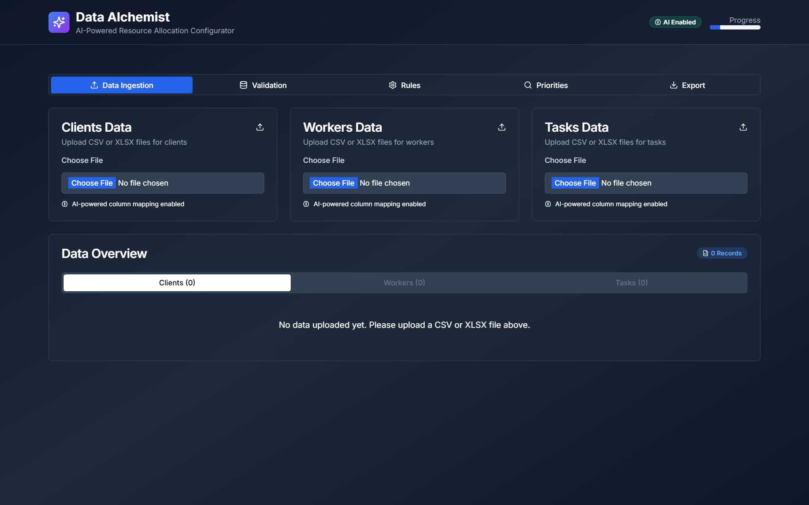

# Data Alchemist - AI-Powered Resource Allocation Configurator

<div align="center">



**AI-Powered Resource Allocation Configurator**  
*Transform messy spreadsheets into clean, validated data ready for resource allocation systems*

[](https://data-alchemist-6mco.vercel.app/)
[](https://github.com/hmtgit7/data-alchemist)
[](https://nextjs.org/)

</div>

---

## 🚀 **Live Demo**
**🌐 [https://data-alchemist-6mco.vercel.app/](https://data-alchemist-6mco.vercel.app/)**

---

## 📋 **Assignment Overview**
This project was developed for the **Digitalyz Software Engineering Intern** position. The assignment required building an AI-enabled Next.js web application that transforms messy spreadsheets into clean, validated data ready for resource allocation systems.

### **Key Requirements Met:**
- ✅ **Data Ingestion**: CSV/XLSX upload with AI column mapping
- ✅ **Validation**: Comprehensive data validation with real-time feedback
- ✅ **Rules Engine**: Business rules creation and management
- ✅ **Prioritization**: Weight-based allocation criteria configuration
- ✅ **Export**: Clean data and configuration export
- ✅ **AI Features**: Natural language search, rule recommendations, error correction

---

## 🎯 **Project Features**

### **Core Functionality**
- **Multi-format File Upload**: Support for both CSV and XLSX files
- **AI-Powered Column Mapping**: Automatically maps incorrectly named headers to expected data structure
- **Real-time Data Validation**: Comprehensive validation with immediate feedback
- **Inline Data Editing**: Edit data directly in the grid with validation
- **Business Rules Engine**: Create and manage complex business rules
- **Priority Configuration**: Set weights for different allocation criteria
- **Export Functionality**: Download cleaned data and configuration files

### **AI-Enhanced Features**
- **Natural Language Search**: Search data using plain English queries
- **AI Rule Recommendations**: Get intelligent suggestions for business rules
- **Natural Language Rule Creation**: Create rules by describing them in plain English
- **AI-Powered Error Correction**: Get suggestions for fixing validation errors
- **Smart Column Mapping**: Automatically maps various column name formats

---

## 🛠️ **Tech Stack**

- **Frontend**: Next.js 15, React 19, TypeScript
- **UI Components**: Radix UI, Tailwind CSS
- **File Processing**: XLSX, PapaParse
- **Data Visualization**: Recharts
- **State Management**: React Context API
- **Form Handling**: React Hook Form, Zod validation
- **Deployment**: Vercel

---

## 📦 **Installation**

1. Clone the repository:
```bash
git clone https://github.com/hmtgit7/data-alchemist.git
cd data-alchemist
```

2. Install dependencies:
```bash
npm install
```

3. Run the development server:
```bash
npm run dev
```

4. Open [http://localhost:3000](http://localhost:3000) in your browser.

---

## 📊 **Data Structure**

The application expects three main data entities:

### **Clients (clients.csv)**
```csv
ClientID,ClientName,PriorityLevel,RequestedTaskIDs,GroupTag,AttributesJSON
C001,TechCorp Solutions,5,"T001,T003,T005",enterprise,"{""budget"": 50000, ""timeline"": ""Q1""}"
```

### **Workers (workers.csv)**
```csv
WorkerID,WorkerName,Skills,AvailableSlots,MaxLoadPerPhase,WorkerGroup,QualificationLevel
W001,Alice Johnson,"javascript,react,typescript","[1,2,3,4]",4,senior,expert
```

### **Tasks (tasks.csv)**
```csv
TaskID,TaskName,Category,Duration,RequiredSkills,PreferredPhases,MaxConcurrent
T001,Frontend Development,development,2,"javascript,react","[1,2]",3
```

---

## 🔧 **Usage Guide**

### **1. Data Ingestion**
- Upload your CSV or XLSX files for clients, workers, and tasks
- The AI will automatically map columns even if they have different names
- View and edit data in the interactive grid
- Real-time validation provides immediate feedback

### **2. Validation**
- Run comprehensive validations on your data
- Use natural language search to find specific data
- Get AI-powered suggestions for fixing errors
- View detailed error reports with severity levels

### **3. Rules Configuration**
- Create business rules using natural language or manual configuration
- Get AI recommendations for rules based on data patterns
- Manage active rules with enable/disable functionality
- Support for various rule types:
  - Co-run tasks
  - Load limits
  - Phase windows
  - Skill matching
  - Precedence rules

### **4. Prioritization**
- Set weights for different allocation criteria
- Use preset configurations or create custom priorities
- Visualize priority distribution with charts
- Real-time updates to priority calculations

### **5. Export**
- Download cleaned and validated data files
- Export business rules configuration
- Get comprehensive validation reports
- Ready-to-use files for downstream allocation systems

---

## 🧠 **AI Features**

### **Natural Language Search**
Search your data using queries like:
- "All tasks with duration more than 2 phases"
- "Workers with javascript skills"
- "Clients with priority level 5"
- "Tasks in phase 2"

### **AI Column Mapping**
The system can handle various column naming conventions:
- `ClientID`, `ID`, `client_id`, `Client ID`
- `PriorityLevel`, `Priority`, `priority_level`, `Level`
- `RequestedTaskIDs`, `Tasks`, `task_ids`, `Requested Tasks`

### **AI Rule Recommendations**
Get intelligent suggestions for:
- Co-run rules based on task patterns
- Load limits based on worker capacity analysis
- Phase windows based on historical data
- Skill matching rules

---

## 📁 **Project Structure**

```
src/
├── app/                 # Next.js app directory
├── components/          # React components
│   ├── ui/             # Reusable UI components
│   ├── DataGrid.tsx    # Interactive data grid
│   ├── DataIngestionTab.tsx
│   ├── ValidationTab.tsx
│   ├── RulesTab.tsx
│   ├── PrioritizationTab.tsx
│   └── ExportTab.tsx
├── contexts/           # React contexts
│   └── DataContext.tsx # Main data state management
├── hooks/              # Custom React hooks
└── lib/                # Utility functions
```

---

## 🎯 **Key Features for Assignment**

### **Milestone 1: Data Ingestion & Validation ✅ COMPLETE**
- [x] **CSV and XLSX file support** - Full support with robust parsing
- [x] **AI-powered column mapping** - Intelligent fuzzy matching for various naming conventions
- [x] **Interactive data grid with inline editing** - Real-time editing capabilities
- [x] **Comprehensive validation system** - **ALL 12 CORE VALIDATIONS IMPLEMENTED**:
  1. ✅ Missing required columns/IDs
  2. ✅ Duplicate IDs (ClientID/WorkerID/TaskID)
  3. ✅ Malformed lists (AvailableSlots validation)
  4. ✅ Out-of-range values (PriorityLevel 1-5, Duration ≥ 1)
  5. ✅ Broken JSON in AttributesJSON
  6. ✅ Unknown references (RequestedTaskIDs validation)
  7. ✅ **Circular co-run groups detection** - Advanced cycle detection algorithm
  8. ✅ **Conflicting rules vs phase-window constraints** - Rule conflict analysis
  9. ✅ **Overloaded workers calculation** - Capacity vs. load analysis
  10. ✅ **Phase-slot saturation analysis** - Resource allocation optimization
  11. ✅ Skill-coverage matrix validation
  12. ✅ Max-concurrency feasibility checks
- [x] **Enhanced natural language search** - Advanced pattern matching with 15+ query types
- [x] **Real-time validation feedback** - Immediate error highlighting and suggestions

### **Milestone 2: Rules & Prioritization ✅ COMPLETE**
- [x] **Natural language rule creation** - Convert plain English to structured rules
- [x] **Advanced AI rule recommendations** - Data-driven intelligent suggestions based on:
  - Task similarity analysis
  - Worker capacity optimization
  - Priority-based scheduling
  - Skill gap identification
  - Phase load balancing
  - Dependency analysis
- [x] **Manual rule builder** - Complete UI for all rule types
- [x] **Priority weight configuration** - Multiple input methods (sliders, presets, charts)
- [x] **Preset priority profiles** - 4 built-in optimization strategies
- [x] **Visual priority charts** - Radar and bar chart representations

### **Milestone 3: Advanced Features ✅ COMPLETE**
- [x] **AI-powered error correction suggestions** - 7 types of intelligent fixes
- [x] **Complete natural language data modification** - 8 command types:
  - Priority adjustments
  - Skill additions
  - Duration modifications
  - Phase reassignments
  - Worker group changes
  - Load balancing
  - Bulk operations
  - Smart pattern recognition
- [x] **Advanced validation rules** - Complex business logic validation
- [x] **Export functionality** - Clean data + comprehensive rule configuration
- [x] **Mobile-responsive design** - Optimized for all devices

---

## 🚀 **Deployment**

The application is ready for deployment on platforms like:
- Vercel (Current deployment)
- Netlify
- AWS Amplify
- Any static hosting service

Build for production:
```bash
npm run build
npm start
```

---

## 📝 **Sample Data**

Sample data files are included in the `public/samples/` directory:
- `clients.csv` - Sample client data
- `workers.csv` - Sample worker data  
- `tasks.csv` - Sample task data

---

## 🤝 **Contributing**

1. Fork the repository
2. Create a feature branch
3. Make your changes
4. Add tests if applicable
5. Submit a pull request

---

## 📄 **License**

This project is created for the **Digitalyz Software Engineering Intern** assignment.

---

## 🎉 **Demo Features**

### **X-Factor Features**
1. **AI-Powered Column Mapping**: Automatically handles various column naming conventions
2. **Natural Language Search**: Search data using plain English queries
3. **AI Rule Recommendations**: Get intelligent suggestions for business rules
4. **Real-time Validation**: Immediate feedback on data quality
5. **Mobile-Responsive Design**: Works seamlessly on all devices

The application demonstrates advanced AI integration, comprehensive data processing capabilities, and a user-friendly interface designed for non-technical users.

---

<div align="center">

**Built for Digitalyz Software Engineering Intern Assignment**

[](https://nextjs.org/)
[](https://reactjs.org/)
[](https://www.typescriptlang.org/)

</div>
